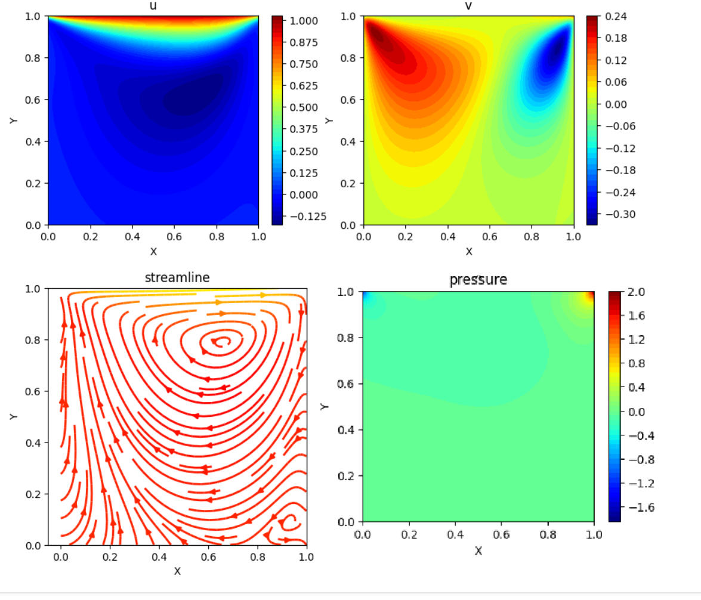
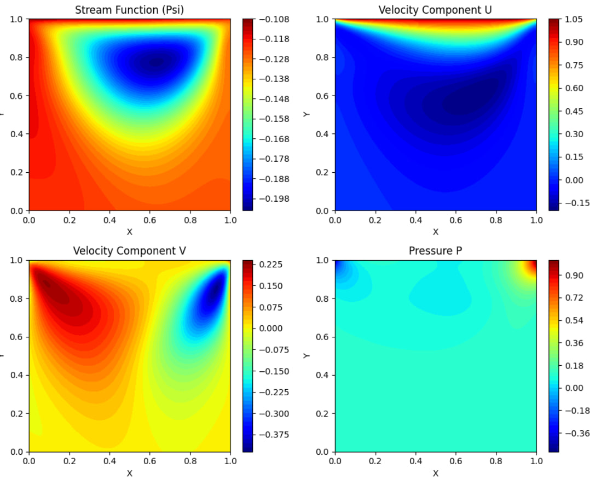
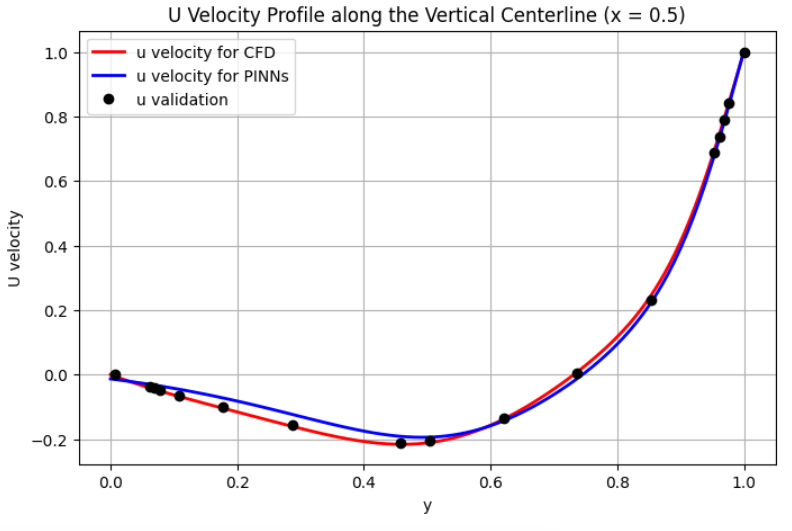

# cavity_pinns
## Solving the Lid-Driven Cavity Problem Using Physics-Informed Neural Networks (PINNs)

To solve the governing equations of the Lid-Driven Cavity problem using Physics-Informed Neural Networks (PINNs), two approaches can be considered.

### Approach 1: Solving the Continuity and Momentum Equations
In this approach, the governing equations are:

* Continuity Equation:

  `u_x + v_y = 0`

* Momentum Equations:

  `u*u_x + v*u_y + p_x/rho - nu*(u_xx + u_yy) = 0`

  `u*v_x + v*v_y + p_y/rho - nu*(v_xx + v_yy) = 0`

where:
- `u` is the velocity in the x-direction.
- `v` is the velocity in the y-direction.
- `p` is the pressure.
- `rho` = 1 is the fluid density.
- `nu` = 0.01 is the kinematic viscosity.

The boundary conditions are set such that the top wall has a velocity of 1 in the x-direction.

In this approach, the neural network consists of:
- Inputs: `(x, y)` (spatial coordinates)
- Outputs: `(p, u, v)` (pressure and velocity components)

The weights and biases of the neural network are optimized using the Adam algorithm by computing the velocity and pressure values. The solution is obtained by minimizing the loss function, which includes the residuals of the continuity and momentum equations in both the x and y directions.

### Approach 2: Using Stream Function
In the second approach, the neural network consists of:
- Inputs: `(x, y)` (spatial coordinates)
- Outputs: `(p, psi)` (pressure and stream function)

The velocity components are derived from the stream function (psi) as follows:
`u = psi_y`, `v = -psi_x`

Since this formulation inherently satisfies the continuity equation, there is no need to compute the loss function for the continuity equation.

In both approach, the neural network is fully physics-informed, meaning it is trained without any external data. Instead, the network learns directly from the governing equations themselves, using the physics embedded within them to guide the training process. The network is optimized to satisfy the continuity and momentum equations without requiring traditional dataset inputs.The implementation is done using the PyTorch library, which provides the necessary tools for building, training, and optimizing the neural network efficiently.

## Neural Network Specifications
```
----------------------------------------------------------------
        Layer (type)               Output Shape         Param #
================================================================
            Linear-1                [-1, 2, 16]              48
            Linear-2                [-1, 2, 32]             544
            Linear-3                [-1, 2, 32]           1,056
            Linear-4                [-1, 2, 16]             528
            Linear-5                 [-1, 2, 2]              34
================================================================
Total params: 2,210
Trainable params: 2,210
Non-trainable params: 0
----------------------------------------------------------------
Input size (MB): 0.00
Forward/backward pass size (MB): 0.00
Params size (MB): 0.01
Estimated Total Size (MB): 0.01
```
The tanh activation function was used, and optimization was performed using the Adam optimizer.
Once the solution approached convergence, the BFGS algorithm was applied to improve accuracy.

## Result for  Approach 1



## Result for  Approach 2



## Validation 
The validation of the results was performed both with CFD results (Matlab code) and with the experimental results from [Ghia et al., 1982](https://doi.org/10.1016/0021-9991(82)90058-4).



## Reference

* [M. Raissi, et al., Physics Informed Deep Learning (Part I): Data-driven Solutions of Nonlinear Partial Differential Equations, arXiv: 1711.10561 (2017).](https://arxiv.org/abs/1711.10561)
* [M. Raissi, et al., Physics Informed Deep Learning (Part II): Data-driven Discovery of Nonlinear Partial Differential Equations, arXiv: 1711.10566 (2017).](https://arxiv.org/abs/1711.10566)
